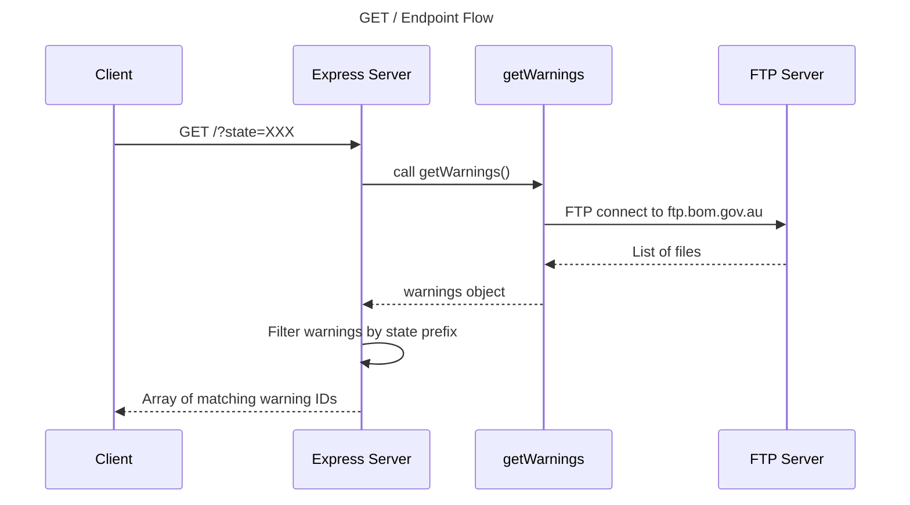
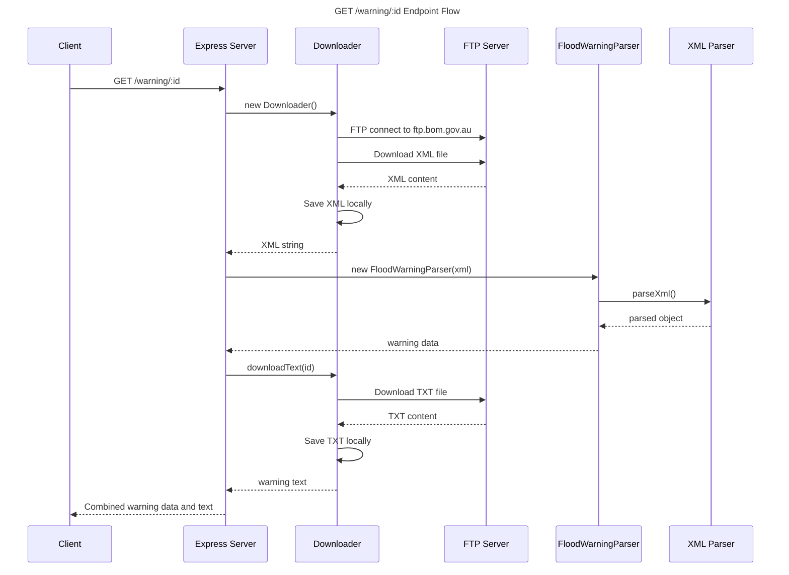
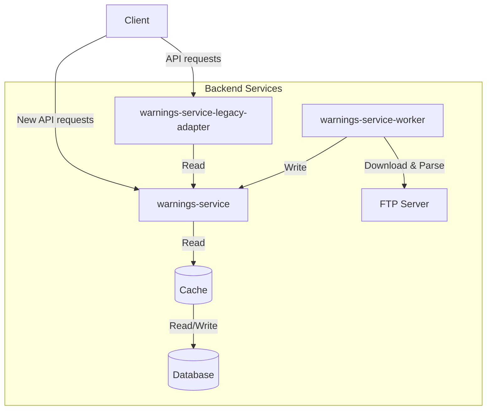

# BOM Warning Service Refactoring Report

The Bureau of Meteorology (BOM) Warning Service is a critical API that ingests and parses warnings and notices from the Bureau of Meteorology. The service has been operational for some time and was initially developed by a third-party contractor. With upcoming requirements for new features and a projected 1000x increase in traffic load, this report outlines the current state of the codebase and provides a comprehensive plan for improvement.

## Overview of current state

The codebase exhibits several critical issues that need to be addressed before scaling to meet future requirements:

### Architectural Concerns
The application lacks proper architectural patterns and separation of concerns. Business logic is tightly coupled with route handlers, making the code difficult to maintain and extend. There is no clear service layer separation or repository pattern implementation, resulting in mixed responsibilities across components.

### Performance Bottlenecks 
- FTP connections are created per request without connection pooling
- Synchronous file operations block the event loop
- No caching strategy for frequently accessed data
- Inefficient XML parsing
- Logger implementation causes I/O bottlenecks

### Scalability Limitations
- No cleanup process for log files
- No cleanup process for downloaded FTP files

### Reliability Issues
- Improper error handling throughout the application
- No retry mechanisms for failed operations
- Potential race conditions in file operations
- Risk of disk space exhaustion from unconstrained logging

### Development & Maintenance
- Mixed usage of require() and ES imports
- Lack of TypeScript types and interfaces
- Missing API documentation and OpenAPI specs
- Outdated dependencies with security vulnerabilities
- Absence of code quality tools (ESLint, Prettier)

### Bugs identified
- The ACT state is incorrectly mapped to IDN (NSW's identifier)
- The product type always defaults to "Mixed" regardless of input

## Project setup issues

- No Node.js version specified in package.json
- TSConfig issues:
  - Target needs to be changed to ESNext
  - Module resolution needs to be set to Node
  - Source maps need to be enabled
  - Contains unused configuration options
- Missing ESLint configuration
- Missing Prettier configuration (optional)
- Dependencies are outdated with security vulnerabilities

## Files analysis

### index.ts
- Generic error handling with just console.log(error)
- Using a simple string ERRORMESSAGE instead of proper error responses with status codes
- No type checking on the error object
- Should set appropriate status code
- No validation for the req.query.state parameter
- No validation for the req.params.id parameter
- No proper error responses for invalid inputs
- Route handlers are defined directly in the main file
- Business logic is mixed with route handling
- No middleware separation for validation and logging
- Hardcoded port number
- No environment variable usage
- require() mixed with ES imports
- Unused imports
- No TypeScript types defined for request/response objects
- No interface definitions for the warning data
- Loose typing with toString() calls
- No structured logging

### logger.ts
- The logging logic is identical for both console.log and console.error
- stdLogger(args) passes the array as a single argument instead of using spread operator
- No try/catch around file writes
- No handling of file write errors
- No timestamp
- No log level indication

### getAmocToStateId.ts
- No error handling for invalid state inputs
- Returns "unk" for invalid states, which is not descriptive
- Should throw an error or return a more meaningful response
- Input parameter is typed as string but accepts only specific values
- Should use a union type for valid states
- No TypeScript enum used for state mappings
- Switch statement could be replaced with an object lookup
- Inconsistent state codes

### getAmocToStateId.spec.ts
- No tests for invalid/unknown states
- Should test the "unk" return value for invalid inputs
- All tests are in a single test case
- Could be grouped better (valid states vs invalid states)

### amoc.ts
- The client.close() call is placed after the try-catch block, never executing on error
- Error handling only logs the error and continues execution
- Could return undefined unexpectedly
- Should handle errors more gracefully or rethrow
- Uses for...in loop to iterate over array which is not recommended
- The warns object lacks TypeScript type definitions

### amoc.spec.ts
- Two test cases have identical descriptions ("should download data")
- The tests are not descriptive enough about what they're actually testing
- The tests lack proper error handling scenarios
- The tests don't clean up after themselves (if needed)
- Tests use actual FTP connection, potentially affecting other tests; Better to use mock

### Downloader.ts
- Duplicate code between download and downloadText methods
- Poor error handling and resource cleanup
- Unnecessary FTP verbosity in production code
- File operations without cleanup
- Redundant client.close() statement after the try-catch
- Tests are missing

### floodWarning.ts
- Each method (getWarning, getIssueTime, getEndTime) parses the same XML independently
- Wastes resources with redundant parsing
- Each method wraps parseXml in a new Promise unnecessarily
- Missing break statements in switch causing fall-through behavior
- Excessive use of any type
- Unsafe array access with [0] without checks
- No proper interfaces for the XML structure
- No error handling for XML parsing
- No validation of required fields
- No proper error propagation

### parser.spec.ts
- Using callback pattern with Jest instead of modern async/await
- Large JSON expectation is directly in test file instead of separate fixture
- Contains debug logging (console.log) in test code
- Only tests the happy path with one XML file
- Missing tests for invalid XML, missing fields, error cases, and different XML structures
- No setup/cleanup for file operations

## Service workflow analysis

The service has two main workflows:
1. Fetching warning IDs by state from the FTP server
2. Fetching warning details for a single ID

### Flow 1: Fetching warning IDs by state

### Flow 2: Fetching warning details by ID

## Refactoring plan

Considering current state of the codebase, rewrite of the service would be a good idea. In case if full rewrite is not possible, at least refactoring of the code would help to improve the code quality and make it more maintainable.

Refactoring should focus on improving the separation of concerns, adding proper error handling, implementing caching, and improving the overall architecture.

Main problems are:
- Business logic is tightly coupled with route handlers
- No separation between services, controllers and other application layers
- Poor error handling and logging
- No caching strategy for frequently accessed data
- No health checks or monitoring endpoints
- FTP connections are created per request without connection pooling
- Synchronous file operations block the event loop
- Logger implementation causes I/O bottlenecks
- Production script is using ts-node which is not recommended for production

## Service rewrite plan

Main considerations:

1. Change tech stack to NestJS
2. Separate FTP data fetching from business logic
3. Add caching layer
4. Support existing API as some clients might still use it
5. Manage FTP connection pool

### New service architecture

The new architecture introduces several key components to address the current system's limitations:

1. **warnings-service**: The core API service built with NestJS that handles business logic and data access
2. **warnings-service-legacy-adapter**: Compatibility layer for existing clients
3. **warnings-service-worker**: Background processing service for FTP data fetching and parsing
4. **Cache & Database**: Data persistence layer

This architecture provides several benefits:
- Decouples data fetching from request handling
- Enables horizontal scaling of API and worker services
- Reduces load on FTP server through connection pooling and caching
- Maintains backward compatibility while enabling new features
